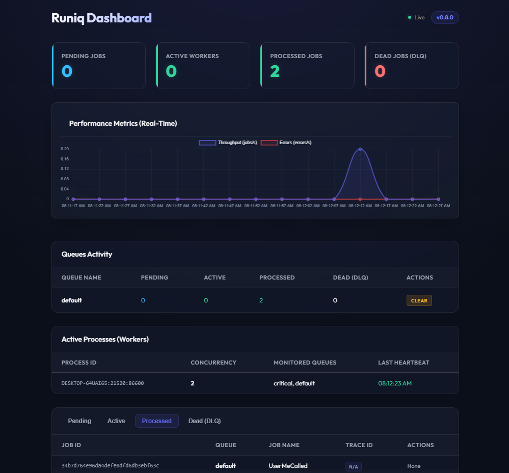

# Orkai Runiq

Orkai Runiq is a background job processor in Go. It is designed to be standalone with zero hard dependencies, while offering optional, interface-driven integration with telemetry and logging engines such as orkai-observability.



## Project Structure

* **queue/**: Contains the core interface declarations and payload structural definitions.
* **test/**: Contains the unit test suite verifying conformance.

## Core Abstractions

### queue/queue.go
* **TraceContext**: Struct encapsulating tracing correlation metadata (TraceID and SpanID).
* **JobEnvelope**: Envelope structure wrapping job parameters and metadata for storage.
* **Storage**: Interface defining the persistence engine operations (Enqueue, Dequeue, Ack, Fail, and GetStats).
* **Job**: Interface with the Perform(ctx, args) signature which must be implemented by any background task.

### queue/postgres.go
* **PostgresStorage**: PostgreSQL driver implementing the Storage interface, utilizing FOR UPDATE SKIP LOCKED for concurrent dequeue safety, auto-creating schema tables, tracking `run_at` scheduled times, moving jobs exceeding `max_attempts` to `'dead'` (DLQ) state, calculating job stats (Pending, Active, Processed, and Dead/Failed), and enforcing concurrency/rate limits using a transactional rate limits log table.

### queue/redis.go
* **RedisStorage**: Redis driver implementing the Storage interface, utilizing pipelined list and hash operations, ZSets for future `run_at` schedules, isolating exhausted jobs in `runiq:dead:{queue}` lists (DLQ), tracking queue stats (Pending, Active, Processed, and Dead/Failed) using dedicated Redis Lists, and enforcing concurrency/rate limits using sliding-window sorted sets.

### queue/client.go
* **Client**: Client helper for enqueuing jobs with transparent Trace ID propagation.

### queue/worker.go
* **WorkerPool**: Concurrent job processor utilizing buffered channel semaphores, context/trace restoration, and panic recovery.

### queue/server.go
* **Server**: Native Go HTTP server displaying an embedded real-time HTML/CSS dashboard (with tabbed logs for Pending, Active, Processed, and Dead (DLQ) states updating every 5 seconds) and serving statistics in JSON format.

### test/queue_test.go
* **TestJobEnvelopeSerialization**: Verifies JSON serialization and deserialization of job envelopes.
* **TestJobInterfaceConformance**: Verifies that job structs correctly implement the Perform signature.

### test/storage_test.go
* **TestPostgresStorageFlow**: Validates Postgres enqueuing, dequeuing, and concurrent isolation of tasks under high worker competition (SKIP LOCKED).
* **TestRedisStorageFlow**: Validates Redis atomic list/hash flow operations.

### test/worker_test.go
* **TestClientTraceExtraction**: Verifies Client enqueues jobs with propagated trace details.
* **TestWorkerPoolExecution**: Validates worker startup, context injection, and success telemetry.
* **TestWorkerPoolPanicRecovery**: Validates that worker handles panics without crashing and marks storage failures.

### test/server_test.go
* **TestDashboardStatsEndpoint**: Verifies that the JSON API endpoint returns correct aggregations.
* **TestDashboardUIEndpoint**: Assures the embedded dashboard template page is loaded and served.

## Usage

### Initializing Storage Drivers

You can choose either PostgreSQL or Redis as the storage backend:

```go
package main

import (
	"context"
	"database/sql"
	"log"

	_ "github.com/lib/pq"
	"github.com/redis/go-redis/v9"
	"github.com/wesleyskap/orkai-runiq/v2/queue"
)

func usePostgres(db *sql.DB) *queue.PostgresStorage {
	storage, err := queue.NewPostgresStorage(db)
	if err != nil {
		log.Fatalf("failed to init postgres: %v", err)
	}
	return storage
}

func useRedis(client *redis.Client) *queue.RedisStorage {
	storage, err := queue.NewRedisStorage(client)
	if err != nil {
		log.Fatalf("failed to init redis: %v", err)
	}
	return storage
}
```

### Enqueuing and Processing with WorkerPool

```go
package main

import (
	"context"
	"fmt"
	"log"
	"time"

	"github.com/wesleyskap/orkai-runiq/v2/queue"
)

// 1. Define a job implementing queue.Job
type SendEmailJob struct{}

func (s *SendEmailJob) Perform(ctx context.Context, args []byte) error {
	fmt.Printf("Sending email with args: %s\n", string(args))
	return nil
}

func main() {
	ctx, cancel := context.WithCancel(context.Background())
	defer cancel()

	// 2. Setup your storage (Postgres or Redis)
	// storage := usePostgres(db)
	
	// 3. Initialize WorkerPool and register jobs
	pool := queue.NewWorkerPool(storage, 3)
	pool.Register("SendEmail", &SendEmailJob{})
	
	go func() {
		if err := pool.Start(ctx, "default"); err != nil {
			log.Printf("Worker pool stopped: %v", err)
		}
	}()

	// 4. Initialize Client and enqueue jobs
	client := queue.NewClient(storage)
	err := client.Enqueue(ctx, "default", "SendEmail", []byte(`{"to":"user@example.com"}`))
	if err != nil {
		log.Fatalf("failed to enqueue: %v", err)
	}

	// 5. Initialize and Start Dashboard Server
	server := queue.NewServer(storage, ":8080")
	go func() {
		if err := server.Start(); err != nil {
			log.Printf("Dashboard server stopped: %v", err)
		}
	}()

	time.Sleep(500 * time.Millisecond) // Wait for worker to consume
}
```

## Job Retries & Scheduling

By default, jobs are executed up to **3 times** with an **exponential backoff delay** (e.g., 10s, 20s, 40s, up to 1 hour) and deterministic jitter if they return an error.

You can customize this behavior by setting `MaxAttempts` and `RunAt` fields on a `JobEnvelope` when enqueuing:

```go
runAt := time.Now().Add(5 * time.Minute)
envelope := &queue.JobEnvelope{
	JobID:       "custom-job-id",
	Queue:       "default",
	Name:        "SendEmail",
	Args:        []byte(`{"to":"user@example.com"}`),
	MaxAttempts: 5,
	RunAt:       &runAt,
}
err := storage.Enqueue(ctx, envelope)
```

Additionally, you can use the client helpers `EnqueueIn` (to execute a task after a duration) and `EnqueueAt` (to execute a task at a specific time):

```go
// Enqueue job to run in 10 minutes
err := client.EnqueueIn(ctx, "default", "SendEmail", []byte(`{"to":"user@example.com"}`), 10*time.Minute)

// Enqueue job to run at a specific timestamp
targetTime := time.Now().Add(2 * time.Hour)
err = client.EnqueueAt(ctx, "default", "SendEmail", []byte(`{"to":"user@example.com"}`), targetTime)
```

## Unique Jobs

Runiq supports unique jobs to prevent enqueuing duplicate tasks while another instance is still pending or processing. You can set the `UniqueKey` and `UniqueTTL` fields:

```go
envelope := &queue.JobEnvelope{
	JobID:     "unique-job-123",
	Queue:     "default",
	Name:      "SendEmail",
	Args:      []byte(`{"to":"user@example.com"}`),
	UniqueKey: "user-email-123",            // The uniqueness lock key
	UniqueTTL: 10 * time.Minute,             // Uniqueness lock duration
}
err := storage.Enqueue(ctx, envelope) // Returns queue.ErrDuplicateJob if a lock already exists

// Or using the client helper:
err = client.EnqueueUnique(ctx, "default", "SendEmail", []byte(`{"to":"user@example.com"}`), "user-email-123", 10*time.Minute)
```

Locks are automatically released when the job completes successfully (`Ack`), fails permanently (exceeds maximum attempts), or is explicitly cancelled via the dashboard or API.

## Recurring Tasks (Cron Jobs)

Runiq supports registering recurring background tasks using standard 5-field cron spec expressions (e.g., `*/15 * * * *`). To avoid duplicate job execution when running multiple replicas of the worker pool, Runiq acquires a distributed lock at the storage level:

```go
// Register a cron job to run every day at midnight UTC
pool.RegisterCron("0 0 * * *", "default", "DailyReport", []byte(`{"format":"pdf"}`))
```

The background scheduler runs automatically inside the `WorkerPool`. At the start of each matched minute, it attempts to acquire a lock for that minute. Only one worker instance in the cluster will succeed and enqueue the task.

## Active Worker Pool Monitoring

When a `WorkerPool` starts, it automatically registers itself with the storage driver using a unique process identifier (comprising the hostname, PID, and a random token). The worker pool then maintains a periodic background heartbeat ticker (every 5 seconds) to signal its health.

The dashboard UI automatically aggregates these worker heartbeats and renders them in the **Active Processes (Workers)** panel, listing all active processes, their concurrency configurations, and their monitored queues. Dead workers are automatically pruned after 15 seconds of inactivity.

## Worker Shutdown

When a `WorkerPool` receives a cancel/termination signal (such as context cancellation during application shutdown), it initiates a shutdown sequence:

1. **Stop Polling**: The worker pool immediately stops fetching new jobs from the storage backend.
2. **Await Executing Jobs**: It uses a `sync.WaitGroup` to track and wait for all currently executing job goroutines to complete.
3. **Shutdown Timeout**: It respects a maximum shutdown wait timeout. If executing jobs do not finish within this duration, the worker pool forces context cancellation on active jobs, letting them fail so that they can be safely re-queued or moved to the DLQ by the storage backend on subsequent runs.

By default, the shutdown timeout is set to **10 seconds**. You can customize this timeout when instantiating the worker pool using the `WithShutdownTimeout` option:

```go
pool := queue.NewWorkerPool(
	storage, 
	5, 
	queue.WithShutdownTimeout(30 * time.Second), // Wait up to 30s for jobs to finish
)
```

## Weighted Queues

By default, workers poll queues in strict linear priority (the order in which queues are passed to `Start`). To avoid starvation of lower priority queues, Runiq allows you to configure relative weights using the `WithQueueWeights` option:

```go
pool := queue.NewWorkerPool(
	storage, 
	5, 
	queue.WithQueueWeights(map[string]int{
		"critical": 3,
		"default":  1,
	}),
)
```

In the example above, `critical` has a weight of 3 and `default` has a weight of 1. During job fetches, the worker pool cycles search preference (yielding a 3:1 ratio of preference), ensuring that the `default` queue is checked first 25% of the time, while still polling all monitored queues to guarantee zero throughput lag.

## Dead Letter Queue (DLQ)

When a job repeatedly fails and exhausts its configured `MaxAttempts` (defaulting to 3 attempts), it is not simply deleted or left in a failed loop. Instead, Runiq automatically moves it to the **Dead Letter Queue (DLQ)** to act as a poison-pill inspector.

- **PostgreSQL Storage**: The job's status field in the `runiq_jobs` table is transitioned to `'dead'`.
- **Redis Storage**: The job envelope is pushed to a dedicated capped list `runiq:dead:{queue}`, keeping only the most recent 50 dead jobs to prevent memory bloat.

The **Dashboard UI** provides a dedicated **Dead (DLQ)** tab to view dead jobs along with their error messages and stack traces. From there, administrators can inspect the failure reason and choose to **Retry** the job immediately (which resets its attempts counter and places it back in the queue) or **Cancel** it permanently.

## Concurrency Throttling & Rate Limiting

Runiq supports global, cluster-wide rate limiting and concurrency throttling per job handler. These settings are registered at the `WorkerPool` level and enforced across all active workers using the storage backend.

- **Max Concurrency Throttling**: Restricts the maximum number of instances of a specific job executing concurrently across all worker pools in the cluster.
- **Rate Limiting**: Restricts the maximum number of job executions allowed within a specific moving time window (sliding window) across all worker pools in the cluster.

To configure these limits, pass `WithMaxConcurrency` and `WithRateLimit` options during handler registration:

```go
// Register with a maximum of 5 concurrent executions globally
pool.Register("PaymentJob", &PaymentJob{}, queue.WithMaxConcurrency(5))

// Register with a rate limit of 100 executions per minute globally
pool.Register("SMSNotification", &SMSNotificationJob{}, queue.WithRateLimit(100, time.Minute))

// Combine both options
pool.Register("ExternalAPI", &ExternalAPIJob{}, 
	queue.WithMaxConcurrency(2),
	queue.WithRateLimit(50, time.Hour),
)
```

### Non-Blocking Postponement
If a job is dequeued and Runiq detects that it exceeds either the concurrency limit or the rate limit, the job is **not blocked** in-memory. Instead:
1. The worker automatically **postpones** the job by shifting it to a scheduled state with a short **1-second delay**.
2. The worker pool immediately continues processing other non-throttled or ready jobs, maintaining maximum throughput and resource utilization across the cluster.

## Workflows & Job Batches (MapReduce)

Runiq supports grouping multiple background jobs into a cohesive workflow group called a `Batch`. This is extremely useful for MapReduce or scatter-gather patterns, where a final callback job should execute only after a group of parallel segment processing tasks have completed successfully.

### Usage Pattern
1. **Initialize the Batch**: Define a callback job envelope.
2. **Enqueue Batch Jobs**: Enqueue multiple parallel jobs associated with the batch.
3. **Submit the Batch**: Seal the batch. This marks the batch enqueuing phase as completed.

```go
// 1. Initialize the batch with a callback job
callback := &queue.JobEnvelope{
	Queue: "default",
	Name:  "OnSuccessCallback",
	Args:  []byte(`{"status":"all_done"}`),
}
batch, err := client.NewBatch(ctx, callback)
if err != nil {
	log.Fatalf("failed to create batch: %v", err)
}

// 2. Enqueue parallel workflow jobs
for _, segment := range segments {
	err := batch.Enqueue(ctx, "default", "ProcessSegment", segment.Data)
	if err != nil {
		log.Fatalf("failed to enqueue segment: %v", err)
	}
}

// 3. Submit the batch to seal it and start execution tracking
err = batch.Submit(ctx)
if err != nil {
	log.Fatalf("failed to submit batch: %v", err)
}
```

### Safety & Resiliency
- **Concurrency & Race Condition Immune**: Runiq tracks batches with state-based safety (`'open'`, `'sealed'`, `'completed'`, `'failed'`). If all parallel jobs finish before the batch is sealed with `Submit()`, the callback is safely deferred until `Submit()` is explicitly executed.
- **Fail-Fast Failure Isolation**: If any job in the batch fails permanently (i.e. is sent to the Dead Letter Queue after exhausting its retries), the batch status transitions to `'failed'` immediately, preventing the callback from ever running.
- **Atomic Backend Storage**: Implemented with native transactions in PostgreSQL (using `FOR UPDATE` and count tracking) and pipeline operations in Redis (using hashes and sets).

## Dynamic Queue Pause & Resume

Runiq supports dynamically pausing and resuming queue processing at runtime. This is highly useful during maintenance windows, downstream outages, or database pressure.

### How It Works
- **Worker Polling Bypass**: When a queue is paused, worker pools skip pulling new jobs from that queue during polling cycles.
- **Active Jobs Unaffected**: Jobs already in progress are unaffected and execute to completion.
- **Persistent State**: The paused status is stored in the database, persisting across worker restarts and application redeployments.
- **Storage Driver Implementations**:
  - **PostgreSQL**: Stores paused queue names in the auto-migrated `runiq_paused_queues` table.
  - **Redis**: Stores paused queue names in the Redis Set `runiq:paused_queues`.

### Controlling Pause/Resume State

You can pause and resume queues directly through:
1. **Dashboard UI**: Interactive **Pause** and **Resume** buttons are available under the queues stats table on the real-time SPA dashboard. A red **Paused** status badge appears next to paused queues.
2. **Administration API**: Use HTTP POST requests to control queue states programmatically.

## Administration API & Dashboard Actions

Runiq's dashboard contains interactive buttons to manage tasks directly. The server exposes the following endpoints:

* **Retry Job**: `POST /api/jobs/retry?id=<job_id>` resets the attempts counter and schedules a failed job for immediate retry.
* **Cancel Job**: `POST /api/jobs/cancel?id=<job_id>` deletes a pending, scheduled, or failed job from the queue.
* **Clear Queue**: `POST /api/queues/clear?name=<queue_name>` removes all pending, active, scheduled, completed, and failed jobs from a specific queue.
* **Pause Queue**: `POST /api/queues/pause?name=<queue_name>` pauses job processing from the specified queue.
* **Resume Queue**: `POST /api/queues/resume?name=<queue_name>` resumes job processing from the specified queue.

## Dashboard Authentication & Custom Middlewares

By default, Runiq exposes the dashboard UI and API endpoints without authentication. To secure the dashboard, you can inject standard HTTP middlewares (e.g. Basic Auth, JWT, session validation) using `queue.WithMiddleware`:

```go
// 1. Define an authentication middleware
func authMiddleware(next http.Handler) http.Handler {
	return http.HandlerFunc(func(w http.ResponseWriter, r *http.Request) {
		username, password, ok := r.BasicAuth()
		if !ok || username != "admin" || password != "secret" {
			w.Header().Set("WWW-Authenticate", `Basic realm="Runiq Dashboard"`)
			http.Error(w, "Unauthorized", http.StatusUnauthorized)
			return
		}
		next.ServeHTTP(w, r)
	})
}

// 2. Initialize and start the Dashboard Server with the middleware
server := queue.NewServer(storage, ":8080", queue.WithMiddleware(authMiddleware))
```

## Telemetry Integration

Runiq defines telemetry boundaries using simple, pluggable interfaces. By default, it falls back to Go standard library logging (slog/log) and skips metrics recording. Integration with external telemetry engines (like orkai-observability) can be enabled by supplying custom implementations of logging and tracing interfaces.

## Running Tests

```powershell
go test ./... -v
```

Expected output:
```text
=== RUN   TestMatchCron
--- PASS: TestMatchCron (0.00s)
=== RUN   TestWorkerPoolCronScheduler_LockAcquired
--- PASS: TestWorkerPoolCronScheduler_LockAcquired (0.00s)
=== RUN   TestWorkerPoolCronScheduler_LockDenied
--- PASS: TestWorkerPoolCronScheduler_LockDenied (0.00s)
=== RUN   TestWorkerPoolCronScheduler_ProcessMatching
--- PASS: TestWorkerPoolCronScheduler_ProcessMatching (0.01s)
=== RUN   TestWorkerPoolWeightedRotation
--- PASS: TestWorkerPoolWeightedRotation (0.00s)
=== RUN   TestWorkerPoolStrictPriorityFallback
--- PASS: TestWorkerPoolStrictPriorityFallback (0.00s)
PASS
ok  	github.com/wesleyskap/orkai-runiq/queue	0.373s
=== RUN   TestJobEnvelopeSerialization
--- PASS: TestJobEnvelopeSerialization (0.00s)
=== RUN   TestJobInterfaceConformance
--- PASS: TestJobInterfaceConformance (0.00s)
=== RUN   TestDashboardStatsEndpoint
--- PASS: TestDashboardStatsEndpoint (0.00s)
=== RUN   TestDashboardUIEndpoint
--- PASS: TestDashboardUIEndpoint (0.03s)
=== RUN   TestAdminEndpoints
--- PASS: TestAdminEndpoints (0.00s)
=== RUN   TestPostgresStorageFlow
    storage_test.go:34: skipping postgres storage tests, service unreachable
--- SKIP: TestPostgresStorageFlow (0.01s)
=== RUN   TestRedisStorageFlow
    storage_test.go:85: skipping redis storage tests, service unreachable
--- SKIP: TestRedisStorageFlow (2.00s)
=== RUN   TestOTelTracer_ExtractAndInjectTrace
--- PASS: TestOTelTracer_ExtractAndInjectTrace (0.00s)
=== RUN   TestOTelTracer_Metrics
--- PASS: TestOTelTracer_Metrics (0.00s)
=== RUN   TestOTelTracer_QueueDepth
--- PASS: TestOTelTracer_QueueDepth (0.00s)
=== RUN   TestClientTraceExtraction
--- PASS: TestClientTraceExtraction (0.00s)
=== RUN   TestClientEnqueueUnique
--- PASS: TestClientEnqueueUnique (0.00s)
=== RUN   TestWorkerPoolExecution
--- PASS: TestWorkerPoolExecution (0.10s)
=== RUN   TestWorkerPoolPanicRecovery
--- PASS: TestWorkerPoolPanicRecovery (0.10s)
=== RUN   TestClientScheduling
--- PASS: TestClientScheduling (0.00s)
=== RUN   TestWorkerProcessRegistration
--- PASS: TestWorkerProcessRegistration (0.05s)
=== RUN   TestClientBatchCreation
--- PASS: TestClientBatchCreation (0.00s)
=== RUN   TestPostgresBatchFlow
--- PASS: TestPostgresBatchFlow (0.15s)
=== RUN   TestRedisBatchFlow
--- PASS: TestRedisBatchFlow (0.12s)
=== RUN   TestBatchFailureDoesNotTriggerCallback
--- PASS: TestBatchFailureDoesNotTriggerCallback (0.50s)
PASS
ok  	github.com/wesleyskap/orkai-runiq/test	3.655s
```

